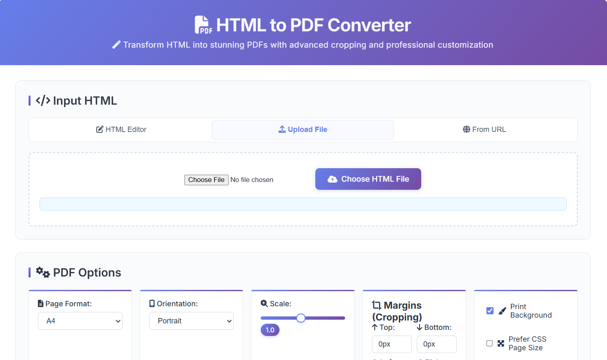
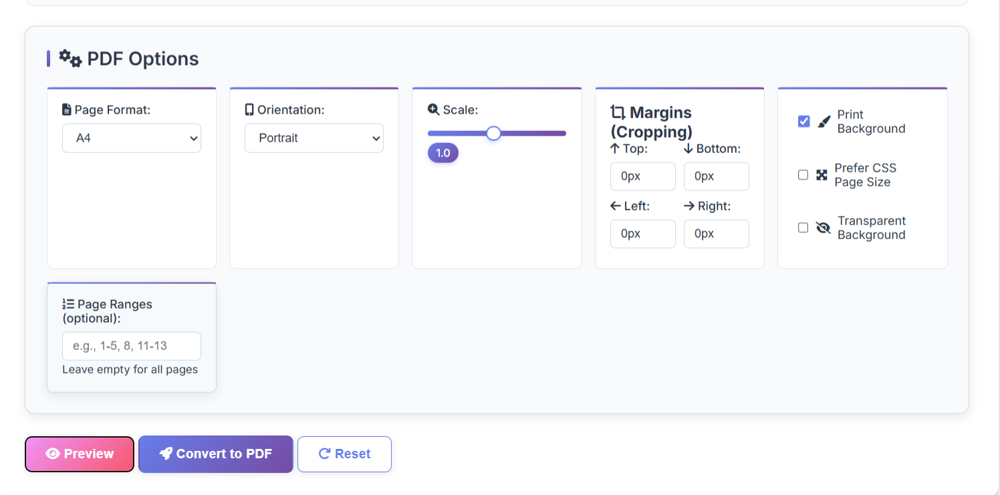

# Alternative Screenshot Layout Options

## Option 1: Side by Side

  
  

## Option 2: With Descriptions
| Main Interface | PDF Options |
|----------------|-------------|
|  |  |
| Clean, modern interface with tabs for different input methods | Comprehensive PDF customization with cropping controls |

## Option 3: Centered with Captions

### 🎨 Main Interface

*Professional interface with Font Awesome icons and tabbed navigation*

### ⚙️ Advanced PDF Options

*Comprehensive customization including cropping, scaling, and formatting controls*

## Option 4: Demo Section
## 🎬 Live Demo

### Interface Overview

### Feature Showcase

Key features visible in the screenshots:
- 📝 Multiple input methods (HTML Editor, File Upload, URL)
- 🎨 Modern UI with Font Awesome icons
- ⚙️ Comprehensive PDF options
- 📏 Advanced margin controls for cropping
- 🔧 Scale and orientation controls
